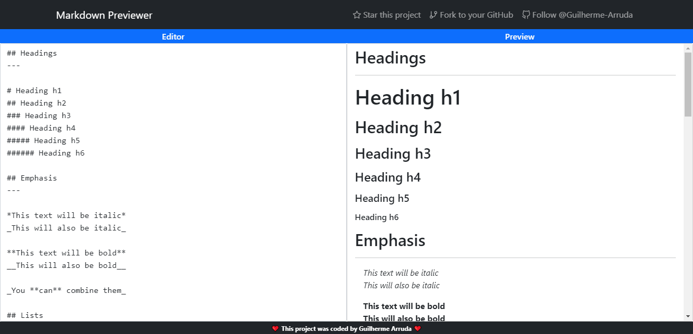

# Markdown Previewer

Online markdown editor with live preview.


## 🤖 Demo

You can view the project demo at [https://guilherme-arruda.github.io/markdown-previewer/](https://guilherme-arruda.github.io/markdown-previewer/).

## 🚀 Getting Started

To run the project in your machine you can clone this repository locally in a directory of your choice using:

```
git clone https://github.com/Guilherme-Arruda/markdown-previewer.git
```

After cloning you need to install all dependencies using:

```bash
npm install
# or
yarn
```

Then you can finally run the project using:

```bash
npm start
# or
yarn start
```

## 📄 License

This project is under MIT license - see the file [LICENSE.md](https://github.com/Guilherme-Arruda/markdown-previewer/blob/master/LICENSE) for details.

---

##### Coded with love by Guilherme Arruda ♥️
